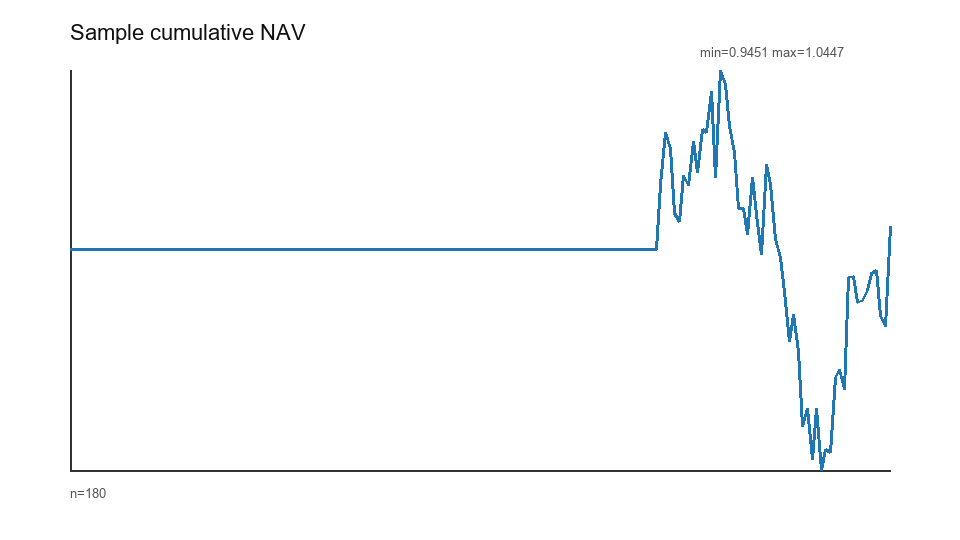
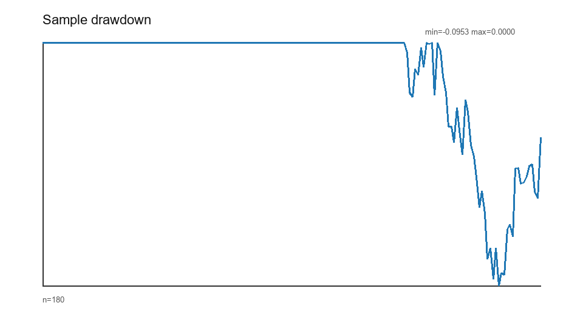
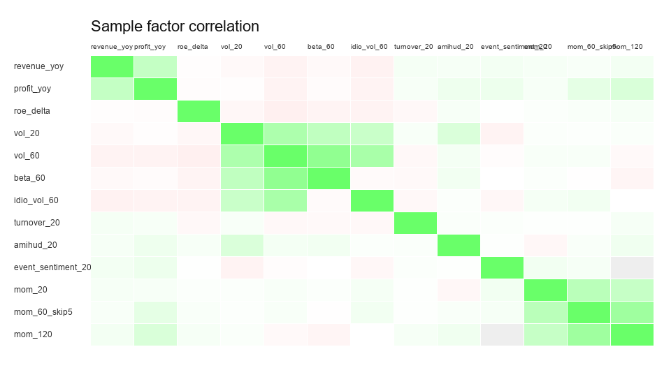

# A 股多因子研究框架

一个面向研究复现、时间一致性审计和执行可行性评估的 A 股多因子选股工程。项目覆盖标准数据接入、Point-in-Time（PIT）因子构建、样本外因子验证、组合约束、事件驱动回测、绩效归因、稳健性检验，以及可审计的 LLM 事件标签流程。

> 本项目是量化研究与工程验证框架。仓库中的样例结果基于合成数据，不代表真实可获得收益，不构成投资建议或交易依据。

## 核心能力

| 研究环节 | 已实现能力 | 主要审计产物 |
|---|---|---|
| 数据工程 | 12 张标准表、CSV/Parquet 导入、字段映射、日期规范化、主键与跨表质量检查 | `data_manifest.json`、数据质量报告 |
| 时间一致性 | 信号日、执行日、目标收益结束日分离；财务公告日与可用日追踪；历史股票池过滤 | `factor_panel_timing.csv`、PIT 测试 |
| 因子研究 | 量价、风险、估值、质量、成长、资金流和事件因子；去极值、标准化与中性化 | IC、HAC t、FDR、非重叠分组、覆盖率、衰减和相关性 |
| 样本外验证 | 滚动训练/验证/测试窗口，历史方向锁定、因子筛选和 IC 权重 | 方向、权重、窗口 IC、样本外 IC 和异常标记 |
| 组合与回测 | TopN、单票与行业上限、最小持仓数、下一交易日开盘执行、订单/成交/持仓审计 | `orders.csv`、`fills.csv`、`positions.csv`、`execution_compliance.csv` |
| 交易约束 | 停牌、涨跌停、ST/板块规则、手数、换手、最小成交额和成交额参与率 | 未成交原因及未成交金额分析 |
| 稳健性检验 | 零/标准/高成本，延迟 1/2/3 日，成交额参与率 1%/5%/10% | `robustness_scenarios.csv`、情景图表 |
| 专业时间序列 | 平稳性/自相关/ARCH/结构突变诊断，过滤式 HMM 状态、Kalman 动态 IC、GJR-GARCH、DCC 小型因子协方差与预测基准比较 | `time_series_diagnostics.csv`、`regime_probabilities.csv`、`dynamic_factor_weights.csv`、`model_selection_audit.csv` |
| 绩效与归因 | 收益、波动、Sharpe、Sortino、Calmar、回撤、相对基准指标和多维贡献分析 | 主动行业暴露、个股/行业/市值/回撤/成本归因 |
| LLM 事件研究 | 默认离线标签器、Prompt/模型版本、JSONL 缓存、原文留痕和人工抽查门槛 | LLM 标签审计 CSV 与 Markdown 报告 |

可部署时序模型统一通过 `PointInTimeForecaster.fit/update/forecast` 调用。接口拒绝晚于 `as_of_date` 的训练观测和不晚于训练截止日的预测目标，并统一返回训练截止日、预测目标日、模型版本、观测数和有效性门槛状态。

## 研究流程

```text
数据拉取或本地导入
        ↓
标准化与数据版本登记
        ↓
质量阻断与 PIT 检查
        ↓
因子构建、处理与覆盖率审计
        ↓
滚动训练 / 验证 / 样本外评分
        ↓
受约束组合构建与事件驱动回测
        ↓
绩效、风险、成本与容量归因
        ↓
可复现的 run 目录、图表和研究报告
```

## 快速开始

### 1. 环境要求

- Python 3.10 或更高版本。
- Windows PowerShell、macOS 或 Linux shell。
- 真实数据导入建议安装 `pyarrow`；AkShare 拉取需要安装 `akshare`。

推荐使用虚拟环境并安装项目依赖：

```powershell
python -m venv .venv
.\.venv\Scripts\Activate.ps1
python -m pip install --upgrade pip
python -m pip install -e ".[data,research,test]"
```

`pyproject.toml` 声明项目的最低依赖契约；`environment.yml` 是当前受支持的 Python 3.12 严格运行环境，可使用更窄的兼容范围；`requirements.txt` 仅作为通用 pip 安装清单。三者如需调整，应在同一变更中说明差异并运行完整质量门禁。当前没有经过验证的 lock file，生成新锁文件前应先在独立环境中完成一致性检查。

如不进行 editable install，可在源码目录运行前设置：

```powershell
$env:PYTHONPATH="src"
```

### 2. 唯一推荐运行入口

```powershell
python -m ashare_factor_research.main validate-config
python -m ashare_factor_research.main run-research `
  --protocol config/research_protocol.yaml `
  --run-id sample-smoke
```

查看版本、运行环境和配置路径：

```powershell
python -m ashare_factor_research.main version
```

## 真实数据工作流

真实模式不会把合成样例通过视为数据有效性证明。进入研究 pipeline 前，数据目录必须包含 `data_manifest.json`，并通过阻断级质量检查。

### 1. 拉取 AkShare 稳定端点

```powershell
python -m ashare_factor_research.main fetch-data `
  --start-date 2024-01-01 `
  --end-date 2024-03-31 `
  --symbols 000001.SZ,600000.SH `
  --tables trade_calendar,stock_basic,daily_bar,benchmark_index `
  --output-dir data/raw/smoke `
  --format csv
```

### 2. 补齐并标准化 PIT 表

历史估值、财务、指数成分、行业、ST、停复牌、涨跌停和事件数据应由可靠的本地数据源补齐，再统一导入。默认协议要求行情历史最晚从 2015-01-01 开始，以支持 2018 年后的 24+6 个月训练/验证及长窗口预热：

```powershell
python -m ashare_factor_research.main import-data `
  --source-dir data/import/incoming `
  --output-dir data/standard/real-v1 `
  --format parquet
```

可通过 `--mapping <yaml>` 提供分表字段映射。导入过程会转换日期、验证 schema 与主键、写入标准表，并登记源文件 SHA-256、字段类型、行数和日期范围。

### 3. 验证数据与执行质量阻断

```powershell
python -m ashare_factor_research.main quality-check `
  --mode real `
  --data-dir data/standard/real-v1 `
  --output-dir outputs/quality/real-v1 `
  --fail-on-blocking

python -m ashare_factor_research.main verify-data `
  --mode real `
  --data-dir data/standard/real-v1
```

### 4. 运行真实研究

```powershell
python -m ashare_factor_research.main run-research `
  --protocol config/research_protocol.real.example.yaml `
  --run-id real-v1 `
  --robustness
```

真实模式会对缺表、重复主键、PIT 错误、价格异常、跨表日期不一致、基准覆盖不足和无法形成样本外评分等问题执行阻断。

## 配置体系

| 配置文件 | 职责 |
|---|---|
| `config/project_config.yaml` | 市场、基准、研究区间、股票池、信号/执行时点、walk-forward 和 LLM 审计规则 |
| `config/factor_config.yaml` | 启用因子、处理参数、覆盖率阈值和中性化设置 |
| `config/backtest_config.yaml` | TopN、权重与行业约束、交易成本、执行限制和稳健性情景 |

CLI 参数可覆盖关键组合参数，但每次标准运行都会保存三份完整配置快照，便于复现和审计。

## 输出契约

每次运行写入独立目录 `outputs/runs/<run_id>/`：

```text
outputs/runs/<run_id>/
├── project_config_snapshot.yaml
├── factor_config_snapshot.yaml
├── backtest_config_snapshot.yaml
├── data_manifest.json
├── research_protocol_snapshot.json
├── run_metadata.json
├── evidence_manifest.json
├── run_summary.md
├── data_quality_report.md
├── metrics.csv
├── orders.csv
├── fills.csv
├── positions.csv
└── figures/
    ├── walk_forward_*.csv
    ├── factor_inference.csv
    ├── group_test_nonoverlap.csv
    ├── monthly_factor_ic.csv
    ├── monthly_factor_returns.csv
    ├── time_series_diagnostics.csv
    ├── regime_probabilities.csv
    ├── dynamic_factor_weights.csv
    ├── volatility_forecasts.csv
    ├── dynamic_covariance.csv
    ├── forecast_comparison.csv
    ├── model_selection_audit.csv
    ├── strategy_oos_comparison.csv
    ├── time_series_report.md
    ├── execution_compliance.csv
    ├── factor_panel_timing.csv
    ├── robustness_scenarios.csv
    ├── unfilled_order_analysis.csv
    ├── active_industry_exposure.csv
    ├── drawdown_contribution.csv
    └── 其他因子、绩效与归因图表
```

`run_metadata.json` 记录 run_id、包版本、Git 基础提交、源码树哈希、配置哈希、数据版本、股票池、因子列表、成本和执行假设。

## 关键研究假设

- 因子在信号日收盘后生成，不允许使用当日收盘信号在同一收盘价成交。
- 默认在下一交易日开盘尝试执行；稳健性模块可额外延迟 1 至 3 个交易日。
- 财务数据仅在 `usable_date` 到达后可见，并保留报告期、公告日和可用日来源字段。
- 历史指数成分、行业、ST、停牌、涨跌停和退市状态必须按当时可见信息处理。
- 训练和验证标签必须在对应窗口边界前完整实现，避免未来收益跨窗泄漏。
- 状态模型只输出截至信号日的 filtered probability，不使用含未来观测的 smoothed probability；动态权重只接收 `availability_date < test_date` 的 IC 标签。
- 真实模式不能形成动态或规则式 OOS score 时直接失败；只有合成样例允许 `score_source=synthetic_fallback`。
- 基准收益必须与策略日期严格对齐，不进行隐式前向填充。
- Q5-Q1 等多空结果是因子诊断，不等同于 A 股市场中的可交易做空收益。
- 回测成本、滑点和冲击参数属于研究假设，不能替代真实成交验证。

## 工程质量

统一质量门禁包含源码编译、单元测试、CLI smoke 和 Notebook smoke：

```powershell
python -m ashare_factor_research.main quality
```

默认 smoke 产物写入临时目录，不改写受版本控制的静态图表；只有显式传入 `--update-artifacts` 才更新展示产物。

也可以分别执行：

```powershell
python -m compileall src tests
python -m unittest discover -s tests
python scripts/smoke_notebooks.py
python -m ashare_factor_research.main build-report
```

## 项目结构

```text
config/                         研究、因子和回测配置
data/sample/                    可提交的合成样例数据
docs/                           数据字典、实施矩阵和补充说明
notebooks/                      按研究流程排列的 7 个 Notebook
reports/                        Markdown/PDF 报告和可复核样例产物
scripts/                        样例生成、质量检查和报告脚本
src/ashare_factor_research/     核心 Python 包
tests/                          单元测试与端到端 smoke test
```

`A-LLM-` 是唯一主线交付目录；工作区其他 `A-LLM-*` 目录仅用于历史追溯，不应加入 `PYTHONPATH`。详见 [历史目录说明](docs/historical_directories.md)。

## 报告与文档

- [研究报告（Markdown）](reports/factor_research_report.md)
- [研究报告（PDF）](reports/factor_research_report.pdf)
- [当前实现状态](reports/implementation_status.md)
- [改进计划实施矩阵](docs/improvement_plan_implementation.md)
- [标准数据字典](docs/data_dictionary.md)
- [Notebook 复现顺序](notebooks/README.md)

核心合成样例图表：







## 局限与风险披露

- 合成样例只能验证工程链路，不能证明因子在真实市场中有效。
- AkShare 仅用于经过保守映射的端点；历史 PIT 数据仍需独立核验来源、修订口径和覆盖完整性。
- 当前执行模型无法完整模拟集合竞价、排队成交、盘口深度、复牌首日和极端市场冲击。
- 多次查看样本外结果并据此反复调参，仍会造成隐性样本外污染。
- LLM 模块仅用于事件结构化和辅助解释；未通过人工抽查门槛的标签不会进入组合信号。

所有结果仅用于量化研究、数据工程和系统开发，不构成任何投资建议。
