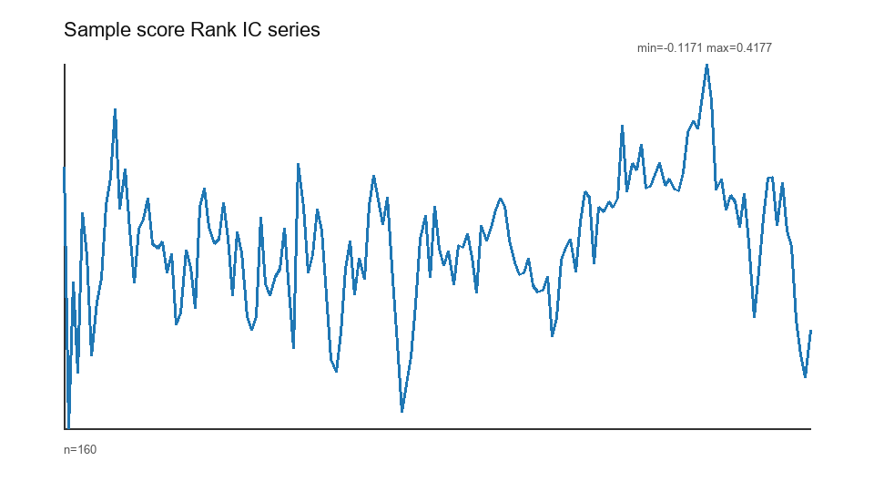
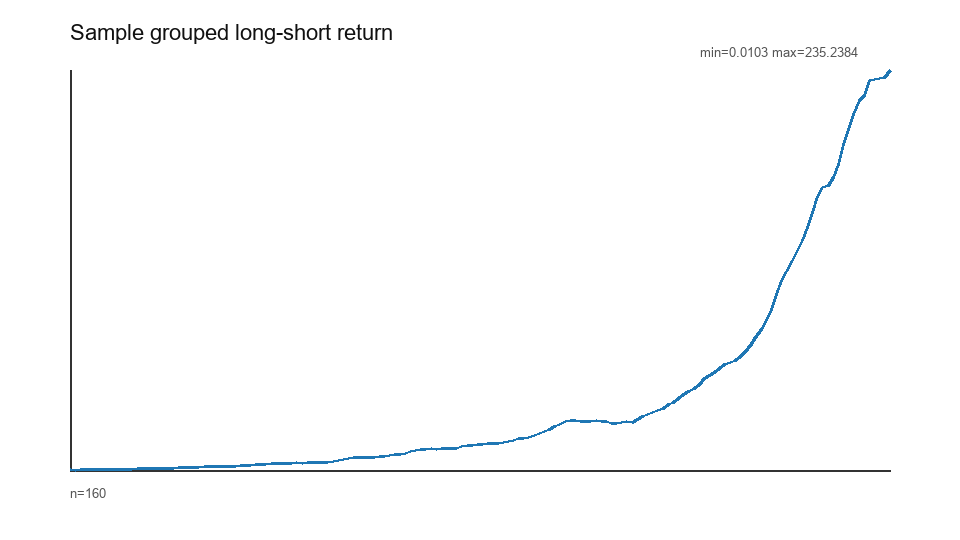
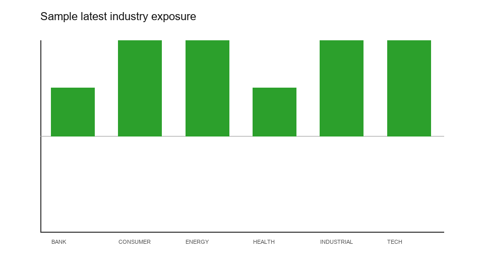

# A 股多因子选股策略研究报告

## 摘要

本报告说明一个以可复现研究流程为目标的 A 股多因子选股框架。当前版本使用项目内合成样例数据验证完整链路，覆盖数据读取、数据清洗、因子构建、因子预处理、IC 检验、分组收益、组合构建、事件式回测、风险暴露和 LLM 事件标签示例。报告中的收益、夏普、回撤、换手等结果只用于检查工程流程是否连通，不代表真实市场可获得收益，也不构成投资建议。

项目的核心产物位于 `reports/figures/`：`performance_metrics.csv` 保存绩效指标，`ic_summary.csv` 保存因子 IC 摘要，`group_returns.csv` 保存分组收益，`factor_corr.csv` 保存因子相关性，`sample_nav.csv`、`sample_orders.csv`、`sample_fills.csv`、`sample_positions.csv` 分别保存净值、订单、成交和持仓。PNG 图表与 CSV 同源生成，便于复核图表背后的数据。

## 数据来源与处理

当前数据由 `ashare_factor_research.data.sample_data` 生成，包含日行情、日估值基础指标、行业分类、财务指标和新闻事件标签。日行情粒度为 `trade_date + ts_code`，字段包括开高低收、成交量、成交额、复权因子、停牌标记、ST 标记和涨跌停价。估值基础表同样以 `trade_date + ts_code` 为主键，包含 PE、PB、总市值、换手率和资金流字段。财务指标表以报告期、公告日、可用日和股票代码描述 point-in-time 可用性。新闻事件表以发布时间和股票代码描述事件类型、情绪、影响周期、置信度和原因。

数据处理遵循以下原则。第一，日期字段统一转换为时间类型，并明确交易日和自然日的区别。第二，日频面板默认以 `trade_date + ts_code` 作为主键检查重复记录。第三，价格相关计算基于复权收盘价，避免把除权除息造成的价格跳变误当作收益。第四，财务数据必须通过 `usable_date` 控制可用时间，原则上只能在公告后下一交易日使用。第五，股票池过滤会剔除停牌、ST 和明显不可交易样本，但当前合成数据不能覆盖退市、长期停牌、真实涨跌停成交限制和历史指数成分变化。

数据风险需要单独说明。当前样例并没有真实指数成分历史、退市股票、真实公告修订历史、真实停复牌和真实涨跌停撮合数据，因此无法证明不存在生存者偏差，也无法验证所有交易在真实市场中可成交。真实数据版本应保存数据来源、拉取时间、字段映射、复权口径和样本空间定义，并在报告中记录数据版本。若只保留当前仍上市股票，或使用未来才能知道的指数成分、行业分类、ST 状态、财务修订值，都可能显著抬高回测表现。

## 因子构建

项目当前实现的因子分为四类。量价因子包括 20 日动量、跳过近 5 日的 60 日动量、5 日反转、20 日波动率、20 日平均换手率和 Amihud 非流动性近似值。基本面因子包括市值、账面市值比、盈利收益率、ROE、毛利率、收入同比和利润同比。资金流因子使用日基础表中的净资金流字段构造 20 日资金流强度。LLM 事件因子使用事件情绪和置信度构造 20 日事件情绪得分。

因子定义必须绑定时间语义。报告采用的默认假设是：因子在信号日 `trade_date` 收盘后计算，组合在下一交易日生效，因子检验目标为未来 20 个交易日收益。这个假设避免了同日收盘信号同日成交的明显未来函数，但仍未完全解决真实开盘成交、集合竞价滑点、涨跌停不可买卖、停牌复牌、调仓延迟和订单冲击问题。真实版本应把信号日、执行日、持有期结束日和收益计算窗口写入每个输出文件的元数据。

Notebook `03_factor_construction.ipynb` 会输出 `reports/notebook_outputs/factor_coverage.csv`，pipeline 还会输出按日期、行业和市值分桶的覆盖率审计。覆盖率是解释结果前必须检查的内容。如果某些因子只覆盖少数股票或少数日期，IC 和分组收益可能主要反映样本选择，而不是因子有效性。基本面因子还需要关注公告集中期造成的覆盖断点，资金流和换手类因子需要关注零成交和停牌记录，LLM 事件因子需要关注事件覆盖是否集中在少数行业或少数股票。

## 因子预处理

因子预处理由 `factor_processor` 完成，当前包括 MAD 去极值、截面 z-score 标准化，以及可选的行业和市值中性化。预处理必须在每个交易日的横截面内完成，不能跨日期使用未来样本。中性化只应使用信号日已知的行业和市值字段，不能使用未来行业调整或未来市值。若真实研究中引入更多风格因子，例如 Beta、波动率、流动性、估值和成长暴露，应明确残差化的自变量、截面样本、缺失处理和回归权重。

当前样例采用所有处理后因子的简单均值作为组合 score。这种方式便于演示，但不是严谨的生产级模型。真实研究应在训练区间内确定因子方向和权重，并在样本外区间固定规则检验。若根据全样本 IC 对因子方向、权重、调仓频率或过滤规则反复调整，就会产生样本外污染和重复调参偏差。报告展示阶段应把“框架验证”和“策略有效性证明”严格区分。

## 因子有效性检验

因子检验包括 Rank IC、ICIR、命中率、t 值、分组收益、多空组差和因子相关性。检验结论应关注稳定性，而不是只看均值。一个因子如果平均 IC 为正，但主要由少数极端日期贡献，或只在某个行业、某个市值区间、某个短样本期有效，就不能直接作为稳健信号。当前输出了 `ic_summary.csv`、`ic_series.csv`、`group_returns.csv` 和 `factor_corr.csv`，后续真实数据版本应继续增加分年度 IC、滚动 IC、分市场状态 IC、因子衰减、覆盖率分组、行业中性前后对比和成本敏感性。

分组收益用于检查因子排序是否具有单调性。当前 `group_return.png` 展示的是 score 的 Q5-Q1 累计差值。若真实数据中分组曲线不单调，或者多空收益来自空头端而 A 股实际难以做空，则不能简单把多空收益解释为可交易收益。对于只能做多的组合，更应关注 Top 组相对基准的超额、换手和回撤，而不是理论多空价差。

## 多因子组合构建

组合构建使用月末调仓日期，在每个调仓日根据 score 选择 TopN 股票并等权配置，同时设置单票最大权重。样例参数为 `top_n=10`、`max_weight=0.2`。当选股数量不足以在最大权重约束下满仓时，组合构建函数会抛出错误，而不是静默放松约束。这种处理有助于暴露配置不可行问题。

当前组合没有使用行业中性约束、行业偏离约束、单日最大买卖金额、最小成交额、现金权重目标或基准成分约束。事件式回测已经输出订单、成交和持仓，并考虑下一交易日开盘执行、手数约束、涨跌停和停牌阻断、资金不足和最大换手限制，但样例数据仍不能代表真实盘口和成交深度。尤其在 A 股市场中，涨停股票不可买、跌停股票不可卖、停牌股票无法调仓、小市值股票容量有限，这些问题会显著影响可执行收益。

## 回测结果

回测由 `run_event_backtest` 完成。信号日期为 T，目标权重从下一交易日开始生成订单并按开盘价尝试成交。净值使用收盘价盯市，成本模型包含佣金、印花税、滑点和冲击成本的基础扣减。`sample_orders.csv` 记录请求数量、成交数量、目标权重、当前权重和未成交原因；`sample_fills.csv` 记录成交价格、数量、名义金额和成本拆分；`sample_positions.csv` 记录每日持仓市值和权重。相比只输出净值的回测，这些表更容易审计交易是否真的发生。

绩效指标以 `performance_metrics.csv` 为准，年化默认使用 252 个交易日。由于样本长度较短且数据为合成数据，年化收益、夏普和 Calmar 对样本路径非常敏感。报告不应把该结果宣传为策略真实收益，而应作为流水线是否能计算、保存、复现和展示指标的验证。

当前 `excess_return.png` 使用现金零收益作为占位基准，因为样例数据没有真实指数收益表。真实研究应接入沪深 300、中证 500、中证 1000 或与股票池一致的自定义基准，并计算 Alpha、Beta、跟踪误差、信息比率和超额回撤。若基准不匹配，例如用大盘指数评价小盘股票池，超额表现可能主要来自风格暴露而不是选股能力。

## 风险归因与稳健性检验

当前风险输出包括净值回撤、回撤区间、月度收益热力图、年度收益、换手率、成本归因和行业暴露。行业暴露由组合权重与信号日行业分类聚合得到，用于观察组合是否集中在少数行业。样例中行业分类是按股票顺序合成生成的，不能用于真实行业风险判断。真实版本应接入申万或中信行业分类，并检查行业暴露是否在调仓日后发生显著漂移。

稳健性方面，当前版本仍有明显不足。第一，没有完整样本内、样本外和滚动窗口划分。第二，没有对调仓频率、持仓数量、权重上限和成本假设做系统敏感性分析。第三，没有比较不同市场环境下的表现。第四，没有容量分析和逐日成交额占比约束。第五，没有把收益贡献拆分到行业、因子、个股、换手成本和尾部交易日。后续版本应优先补齐这些检查，而不是继续增加因子数量。

## LLM 辅助模块

LLM 事件模块的定位是辅助解释与事件标签结构化，不是直接生成交易指令。当前样例新闻事件由脚本构造，字段包括事件类型、情绪、影响周期、置信度和原因。事件因子根据情绪方向和置信度聚合为 20 日事件情绪得分，并与其他因子合并。真实使用中，LLM 可能出现幻觉、误分类、遗漏、重复事件、发布时间偏差和文本来源偏差，因此必须有人审抽样、prompt 版本记录、标签一致性评估和失败重试记录。

在研究报告中，LLM 模块更适合回答“为什么某些股票在某个窗口出现异常收益或风险”，而不是自动给出买卖建议。若后续接入公告、新闻或研报摘要，应明确文本发布时间、抓取时间、去重规则和可用时间，避免把盘后或未来发布的信息提前用于信号日。

## 结论、不足和改进方向

本项目已经形成一个可顺序复现的研究展示框架：Notebook 负责过程复现，`reports/figures/` 保存图表和 CSV，Markdown 报告负责结论叙事，README 负责快速展示。当前最重要的价值不是样例收益，而是把信号日、执行日、目标收益、成本、回撤、换手、行业暴露、订单成交审计和 LLM 风险放在同一个可验证流程中。

主要不足包括：数据为合成样例，不能证明真实因子有效；股票池没有真实历史成分和退市处理；回测没有真实盘口深度和市场冲击校验；基准收益缺失，超额收益目前只是现金基准占位；没有完整样本外验证、参数敏感性和容量评估；LLM 事件标签没有真实文本抓取和人工一致性检验。

下一步建议按风险优先级推进。第一，接入真实数据并记录数据版本，重点补齐交易日历、指数成分、ST、停复牌、涨跌停和复权口径。第二，建立数据质量报告，检查主键、缺失、异常价格、成交额、覆盖率和时间对齐。第三，加入样本内外切分、滚动 IC、分年度表现、成本敏感性和参数敏感性。第四，完善回测执行层，加入成交额容量、延迟成交和订单失败后的持仓延续策略。第五，在 LLM 模块中加入 prompt 版本、人工抽查和标签质量评估。只有这些检查通过后，才适合讨论策略是否具备进一步研究价值。

## 免责声明

本报告仅用于量化研究流程、数据工程和系统开发展示。所有图表和指标基于合成样例数据或框架占位假设，不构成任何投资建议，不代表真实可获得收益，也不应作为交易决策依据。
